# Architecture and ownership

## Scope and design choices

Build a Layer 7 reverse proxy for APIs with a static file configuration first.
Use Go's `net/http` server, `http.Transport`, and `httputil.ReverseProxy` as the
protocol foundation. Own routing, service policy, configuration, and operations.
Avoid writing HTTP framing, TLS, or a custom event loop.

Traefik offers a useful separation between entrypoints, routers, middleware, and
services ([official overview](https://doc.traefik.io/traefik/v3.2/routing/overview/)).
Janus borrows those responsibilities without adding providers or plugins initially.

NGINX uses an event-driven architecture; Go supplies its own runtime network
polling and goroutine model. Copying NGINX's C worker structure is not a goal.
Its operational lessons about connection reuse and resource limits are relevant
([NGINX development guide](https://nginx.org/en/docs/dev/development_guide.html)).
Neither architecture makes one product inherently faster for every workload.

## Request path

```mermaid
flowchart LR
    C[Client] --> E[Existing TLS load balancer]
    E --> L[HTTP listener]
    L --> A[Admission limits: planned]
    A --> R[Host and path router]
    R --> M[Route policies: planned]
    M --> S[Service / backend selection]
    S --> P[ReverseProxy]
    P --> T[Shared HTTP transport]
    T --> B[Backend]
```



Configuration is a separate path:

```text
file -> decode -> validate -> build handlers and pools -> serve
```

Only the first path executes on each request. Do not parse configuration, compile
patterns, read files, perform service discovery, or construct transports there.

## Package boundaries

| Package | Owns | Must not own |
| --- | --- | --- |
| `cmd/janus` | CLI, signal context, process exit | Routing algorithms or retry rules |
| `config` | External schema and semantic validation | Network calls or runtime mutation |
| `gateway` | Wiring dependencies, server settings | New HTTP protocol implementations |
| `router` | Deterministic host/path selection | Backend availability or dialing |
| `upstream` | Target selection and, later, health state | Request rewriting |
| `proxy` | Forwarding, outbound transport, error mapping | Config discovery or business authentication |

Dependencies run from `cmd` to `gateway`, then to the leaf packages. `proxy` depends
on `upstream`; `router` only knows `http.Handler`. Keep this direction acyclic.
The round-robin counter is atomic; the target list and routes are immutable after
construction. Do not edit config slices while serving requests.

Prefer concrete types until two real implementations justify an interface.
`http.Handler` and `http.RoundTripper` already supply the main extension seams.
Avoid `utils`, generic repositories, a dependency injection framework, an event bus,
and a plugin ABI. They add concepts before the gateway needs them.

## Growth points: add when implementing the capability

Do not create empty directories for every possible feature. The next packages can be:

| Package | When it becomes useful |
| --- | --- |
| `internal/middleware` | Global admission, per-route body limits, IDs, access logging |
| `internal/health` | Bounded active probes, state transitions and recovery hysteresis |
| `internal/admin` | Separate liveness, readiness, metrics and authenticated administration |
| `internal/runtime` | Versioned immutable routing snapshots and reload lifecycle |
| `internal/telemetry` | Metrics/tracing setup and consistent low-cardinality attributes |
| `test/integration` | Cross-package protocol, drain and failure scenarios |
| `test/load` | Reproducible load scenarios and comparative results |
| `deploy` | Hardened image and deployment manifests for the actual target platform |

Use a middleware signature `func(http.Handler) http.Handler`. Specify ordering:
request ID/access observation -> global admission -> routing -> route policy ->
backend selection -> forwarding. Avoid wrappers that accidentally remove flushing
or other response capabilities. Add `Unwrap` and test `ResponseController` behavior
when implementing response observation.

## Transport and resource ownership

One reused transport serves all current services because their TLS and trust
settings are identical. Later, cache transports by an explicit policy key when
services need different CA bundles, client certificates, or timeout settings.
Never mutate a live transport; publish a replacement and retire the old one.

Idle connection capacity and maximum active connections are different controls.
A pool cap alone can turn excess work into a waiting queue. Apply a bounded
in-flight request limit with fast 503 rejection before adding larger pools.
An HTTP/2 connection can carry many streams, so connection limits are not request
concurrency limits. Round-robin here selects per request, not per TCP connection.

Bodies are streamed using the standard reverse proxy. Janus does not buffer entire
responses or spool them to disk. NGINX's optional response buffering is a different
behavior with different latency and backpressure tradeoffs
([proxy buffering](https://nginx.org/en/docs/http/ngx_http_proxy_module.html#proxy_buffering)).
A slow reader can therefore hold resources upstream; deadlines and admission must
be designed together. Add buffer pooling only after profiles show allocation cost.

## Planned reload transaction

1. Read one bounded, complete configuration document from a trusted source.
2. Validate all references, overlaps, limits, TLS files and policy combinations.
3. Build a complete candidate snapshot off the request path.
4. Publish it with `atomic.Pointer` after all construction succeeds.
5. New requests capture one snapshot. Existing requests retain the old snapshot.
6. Retire old probes and transports after readers finish; close idle connections.
7. On any error, retain the last good snapshot and emit a reload failure metric.

Atomic pointer replacement alone does not solve resource cleanup. Track snapshot
ownership and serialize reloads. Keep listener addresses and process-wide settings
restart-only at first; reload routes/services only. No distributed control plane
is needed for a file-configured single process.

## Initial behavior decisions

- Host-specific routes precede hostless routes; longest segment prefix then wins.
- Duplicate matches are invalid. No regex rules or implicit route priorities.
- Backend URL controls the outbound Host and TLS server name.
- Invalid config stops startup before the listening socket opens.
- Unmatched requests return 404; upstream connection failures return 502; upstream
  timeout errors return 504 if no response headers have been sent.
- Once a response starts, a body failure cannot be replaced with a clean 502/504.
  The connection/stream can terminate and telemetry must record the incomplete response.
- No application retries, cache, JWT validation, or rate-limiting dependencies in v0.
- Configuration is trusted operator input; client requests cannot choose arbitrary destinations.

These choices keep the first implementation readable. They are not substitutes for
the resource, security and operational gates in the delivery plan.
