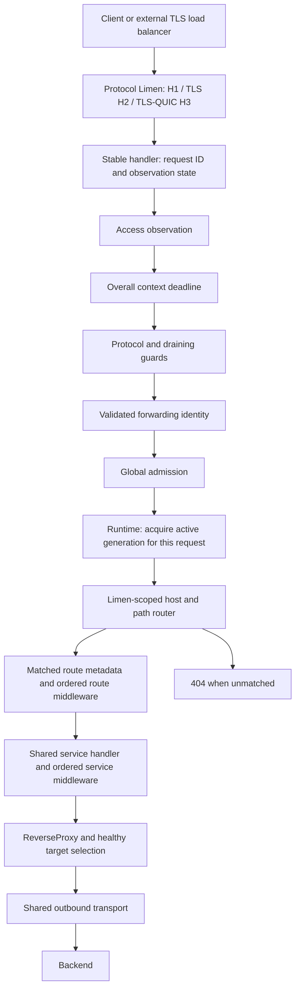

# Protocol Limen, runtime, and middleware architecture

## Scope and implementation status

Janus currently serves bounded-duration HTTP APIs through Protocol Limen on
private HTTP/1.x, native TLS/HTTP/2, explicit h2c, and opt-in native TLS/HTTP/3 listeners,
forwarding to static HTTP/HTTPS origins. Versioned file-based routing reload,
TLS certificate content rotation, SSE, and HTTP/1 WebSocket proxying are
implemented; HTTP/2 WebSocket extended CONNECT, gRPC and arbitrary TCP/UDP
tunnels remain outside this scope. H3 interop and deployment qualification are
not yet complete.
Use Go's `net/http`, `httputil.ReverseProxy`, and `http.Transport` as the protocol
foundation. Backend applications retain business authorization responsibilities.

This is the target design for the phases in [plan.md](plan.md). Today `runtime`
owns the stable dispatcher and process-level transport, while `gateway`
constructs each router, service proxies, pools, and route middleware generation.
The fixed global protocol guard, admission cap, request observation and overall
deadline are applied once by runtime. The route-level `buffer`, route/service
`body_limit`, service `in_flight`, versioned routing reload, TLS
certificate-content rotation, protocol-scoped streaming routes, and
service-owned active health probes, explicit per-limen trusted forwarding and
the private admin metrics endpoint are implemented; admin liveness/readiness is
wired at process scope.

The concrete multi-protocol and reload design is in
[limen-runtime.md](limen-runtime.md). Limen owns protocol servers, runtime owns
the stable dispatcher and generation lifetime, and gateway builds handler graphs.
All HTTP versions reuse the handler contract; raw TCP/UDP protocols require
different contracts. Start with a file source rather than a Provider framework.

We adopt named built-in policies and ordered composition inspired by
[Traefik's middleware model](https://doc.traefik.io/traefik/reference/routing-configuration/http/middlewares/overview/).
Traefik supports router and service attachments, with router middleware executing
first. Janus adds its own fixed global protections and explicit state ownership.
Configuration names and supported policy types are Janus-specific.

## Target request path



The diagram is the completed target; add each node in its delivery phase.
The fixed global chain wraps the generation dispatcher. Protocol servers retain
that stable handler during reload. Requests already dispatched retain their
generation; later requests on the same connection can acquire the new one.
Global protections have a fixed order and cannot be bypassed by omitting a route
reference. Named route middleware runs after matching and cannot cause rerouting.
Named service middleware runs after route middleware and before target selection.
The admin listener is separate and does not pass through this data-path chain.

Access observation wraps downstream guards and policies so it sees early exits.
Requests rejected before routing have an explicit unmatched route/service value.
Malformed requests rejected by `net/http` before handler entry need server-level
error reporting; middleware cannot observe every parser-level rejection.

## Compiled route matching and actions

Routes may provide a small boolean match expression such as
``Host(`api.example.com`) && PathPrefix(`/api`) && Method(`GET`)``. The expression
is parsed and validated while a generation is built. The request path creates
one normalized `RequestFacts` value, looks up candidates through the Limen and
Host indexes and a segment-aware path tree, then evaluates the compiled
conditions. Expressions containing complex `OR` or `NOT` branches remain in a
safe fallback candidate set until a matcher planner can index them without
omitting a possible match.

Every route has one terminal action. `forward` enters the named service and its
service middleware, while `redirect` and `respond` produce a direct HTTP
response. Route middleware still wraps the action, and route metadata is set
before that chain runs. This keeps matching, policy composition and terminal
behavior separate.

The route priority is explicit. Higher `priority` wins; equal priorities use
host specificity, path length and then configuration order as deterministic
tie-breakers. Index construction must only reduce the candidate set; it must
never change that ordering or the final result.

## Composition contract

The initial API is deliberately small:

```go
type Middleware func(http.Handler) http.Handler

// Implemented API: declaration order is request-entry order.
func Chain(final http.Handler, middlewares ...Middleware) http.Handler
```

`Chain(proxy, a, b)` constructs `a(b(proxy))`: entry is `a -> b -> proxy`, and
post-processing unwinds in reverse order. An empty chain returns the final
handler. Build by wrapping in reverse order once, at startup or reload.

Each middleware calls its next handler at most once, or short-circuits with a
response. It may inspect or modify the request before calling next. It must not
change status or headers after commitment, retain the writer after return, or
launch a goroutine that continues writing after the handler has returned.
Cleanup such as cancellation and permit release uses `defer`.

Concurrent requests share constructed handlers. Per-request state belongs to the
request; shared counters require synchronization. Middleware constructors take
typed options and explicit dependencies. Constructors can fail before publication;
ordinary runtime errors use HTTP responses and the request observation outcome.
Do not introduce a new handler error signature or a dependency-injection container.

The overall timeout middleware uses a child context and calls next synchronously.
It preserves an earlier parent deadline and cancels outbound work. It does not
buffer responses or forcibly terminate arbitrary code. Socket deadlines remain
necessary for blocked client reads/writes. Before response commitment a timeout
can become 504 if the socket is writable; afterwards terminate incomplete output.
An abort panic must retain standard server abort behavior, not become a second
response through a generic panic-recovery wrapper.

## Configuration ownership and scopes

| Configuration | Owner and scope | Planned introduction |
| --- | --- | --- |
| Address, protocol/TLS selection, header/read/write/idle limits | Protocol Limen; per-listener settings | HTTP server budgets exist; Limen extraction 2A, TLS/H2 2C |
| Overall request deadline | Fixed global timeout middleware using `request.maximum_duration` | Implemented in Phase 1 |
| Connect/TLS/header timeouts, TCP keepalive, pool limits | Shared outbound `http.Transport` | Already implemented |
| Request ID and access observation | Fixed global middleware; options only when consumed | Phase 2 |
| `middlewares` definitions | Named, typed, reusable configuration; `buffer` is implemented first | Phase 1/2 |
| `routes[].middlewares` | Ordered policies for the matched route; route-level `buffer` is implemented first | Phase 1/2 |
| `services.<name>.middlewares` | Ordered policies on the shared service handler | Phase 2 |
| Global admission, drain and admin settings | Process/listener lifecycle | Admission, admin health, bounded removal delay and total drain budget implemented |
| Health probes | Per-service resource lifecycle | Phase 4 complete |
| Trusted proxy CIDRs and identity rules | Listener trust policy with proxy rewrite integration | Phase 4 complete |
| Routing file and generation publication | Runtime; strict build-before-swap transaction | 2B/2D |
| Certificate/key pair rotation | Limen; validated identity for new handshakes | 2D |

Keep server and transport settings outside the named middleware catalog. The
existing `backend.keep_alive` means TCP keepalive, not HTTP idle-pool duration.
The initial `request.read_timeout` includes headers and body; it is not an idle
timeout between body chunks. Request byte limits are a separate policy.

Only expose fields whose implementation exists. Phase 1 preserves existing keys
while extracting timeout behavior; it introduces a consumed `server.write_timeout`
with documented fallback and bounded error-write headroom. Test both explicit and
omitted values. Current numeric zero means default, not disabled; changing that
requires an explicit schema migration. General duration bounds are 1ms–24h;
`server.write_timeout` may reach 24h + 5s so the required headroom remains
possible at the overall timeout maximum.

### Proposed named policy example

This is a runnable versioned policy example. The current binary accepts the
`body_limit` definition and service attachment shown below; the route-level
`buffer` example remains in `configs/janus.json`.

```json
{
  "listen": "127.0.0.1:8080",
  "middlewares": {
    "small-upload": {
      "body_limit": { "max_bytes": 1048576 }
    },
    "service-body-cap": {
      "body_limit": { "max_bytes": 8388608 }
    }
  },
  "routes": [
    {
      "name": "example-api",
      "host": "",
      "path_prefix": "/api",
      "middlewares": ["small-upload"],
      "service": "example"
    }
  ],
  "services": {
    "example": {
      "upstreams": ["http://127.0.0.1:9000"],
      "middlewares": ["service-body-cap"]
    }
  }
}
```

Names reference built-in typed definitions, not arbitrary executable plugins.
Each definition has exactly one supported type. A small typed factory/switch in
`gateway` builds implementations; `config` validates data and references without
constructing handlers. Preserve strict unknown-field checking inside each type.
Validate unused definitions too, and reject missing references, wrong scopes,
duplicate references within one list, and incompatible policy combinations.
Definitions in a JSON object have no execution order; attachment arrays do.

The implemented configurable policies are route/service `body_limit`,
route-level `buffer`, and service-only `in_flight`. Multiple applicable body
limits compose by the minimum. The example therefore allows at most 1 MiB on
`/api`. Global admission remains fixed infrastructure. Requests must pass both
active caps.
No route-level timeout override or arbitrary global policy list is needed initially.

Initially use flat attachment arrays. A reusable named `chain` can be added when
repetition warrants it; it then requires startup flattening, cycle detection,
and bounded expansion. Traefik's [Chain middleware](https://doc.traefik.io/traefik/reference/routing-configuration/http/middlewares/chain/)
is a reference for that later convenience, not a Phase 1 dependency.

## State and resource ownership

| Object | Runtime ownership | Sharing rule |
| --- | --- | --- |
| Middleware definition | Immutable configuration | Reusable by name without automatically sharing state |
| Limen and fixed global chain | Process lifetime | Shared across routing generations; same runtime for H1/H2/H3 |
| Routing generation | Runtime publication/retirement | One acquired generation per request, released after handler return |
| Route chain | One instance per route attachment | Route policies keep route-local state |
| Service handler / limiter | Handler per generation; limiter state runtime-owned by service ID | Routes share the handler; generations share active permit accounting |
| Global admission | One process-wide instance | All data requests share permits, including across reloads |
| Request observation | One object per request | Fixed outer observer and inner route/proxy stages share synchronized metadata |
| Transport | Process-owned for the initial fixed trust/TLS policy | Services and routing generations share pools; never mutate a live transport |
| Probe workers and backend health | Per service, managed by runtime owner | Start/stop outside the request path |

For example, routes A and B targeting service S must compete for the same S
permits. Services S and T referencing the same named `in_flight` definition get
separate counters. Rebuilding a chain for every route must not silently multiply
service capacity. Connection limits also cannot substitute for request limits:
HTTP/2 can multiplex many requests on one connection.

The access observer creates request state before routing. A small wrapper around
each matched route's handler records route/service IDs before route policies run;
`router` stays independent of telemetry. Inner proxy stages record error class and
completion in the same state so the outer observer can report them after return.
Define synchronization for any concurrent callbacks; do not assume a child context
value set inside a route can be read back from the outer request.

Transparent response wrappers provide `Unwrap` and preserve only the optional
capabilities supported by the underlying writer: Flusher, Hijacker, and Pusher.
They preserve flushing and final/informational status handling. If they expose
`ReaderFrom`, it must update byte counts rather than bypass observation.
Do not pretend unsupported `Hijacker` or other interfaces exist. Test behavior
through the actual proxy/server, including informational responses and body errors.
Buffering has an intentional flush barrier and needs its own capability contract;
unwrapping must not silently let `ResponseController` bypass that barrier.

## Code layout and dependencies

Introduce packages/files only when their implementation phase starts. Proposed
files below are responsibilities, not empty directories to scaffold immediately.

| Package | Responsibility and likely files | First phase |
| --- | --- | --- |
| `cmd/janus` | CLI, process signals, invoke startup/drain | Existing |
| `internal/limen` | Listener and protocol adapters, inbound TLS identity, coordinated server lifecycle | HTTP/1 and TLS/H2 in 2A/2C; first H3 adapter in 5 |
| `internal/config` | Settings, named policy schema, reference/scope validation | Existing; policy types in 2 |
| `internal/gateway` | Builds route/service handler generations from validated config and injected runtime resources | 2B generation builder; server wiring moved to Limen in 2A |
| `internal/middleware` | `chain.go`, `timeout.go`, then IDs, observation, body limits and admission | 1–3 |
| `internal/router` | Immutable host/path matching against prebuilt `http.Handler` | Existing |
| `internal/proxy` | ReverseProxy, outbound transport, trusted-header rewrite, error mapping | Existing |
| `internal/forwarding` | Per-limen trusted CIDR matching and canonical forwarded identity | Phase 4 complete |
| `internal/upstream` | Concurrent target selection and health-based eligibility | Existing; active health complete |
| `internal/telemetry` | Request outcome type, access logging and bounded metrics registry | 2 and 4 complete |
| `internal/admin` | Private liveness/readiness and metrics handlers | 3/4 complete |
| `internal/health` | Bounded scheduled probes and recovery state transitions | 4 complete |
| `internal/runtime` | Stable dispatcher, generation publication, request references, file reload and resource retirement | 2D complete |
| `test/integration`, `test/load`, `deploy` | Cross-package scenarios, load evidence, deployment artifacts | As scenarios arrive |

Dependencies flow from `cmd` to `gateway`, then to leaf packages. `gateway` owns
the mapping from config to middleware constructors. Middleware implementations
do not import `gateway` or route tables. `router` only dispatches handlers.
`proxy` depends on target selection and, when added, neutral observation/identity
types; `telemetry` must not import gateway or middleware. Health workers update a
bounded health store; selection reads it without initiating network probes.

In Phase 2B `runtime` calls the gateway builder; gateway must not import runtime.
`cmd` wires Limen to the runtime handler; Limen depends only on the handler contract.
Avoid a separate service abstraction/package until service lifecycle complexity
requires it. `http.Handler` and `http.RoundTripper` remain the extension seams.
Outbound attempt observation can wrap RoundTripper. Retry needs its own reviewed
replay/body/attempt semantics before implementation and is not enabled by Chain.

## Startup and reload

Current startup: decode and validate -> build gateway handler -> bind and serve
the configured Limen listeners. Target startup: decode and validate -> create process-owned transport -> build
initial route/service generation -> create stable dispatcher and global chain
-> bind Limen listeners -> serve. Close created resources if construction fails. Do not resolve policy
names, read configuration, or allocate connection pools on each request.

Phase 2B/2D routing reload is a transaction. The current poller watches a
versioned JSON file, hashes complete reads, and invokes this transaction only
when content changes:

1. Read one bounded complete document; reject malformed/duplicate keys and invalid
   references. Listener/global/transport settings are in startup config and
   require restart; reject those keys in a routing update.
2. Build a complete candidate with rollback cleanup. Prepare healthy-target state
   and candidate probes under explicit lifecycle ownership before publication.
3. Publish the snapshot atomically. Each accepted request acquires a generation
   reference and releases it on every exit. Acquisition and retirement must be
   synchronized; loading a pointer and incrementing an unprotected counter races.
4. Preserve process-global admission. Reuse service admission state by stable
   service identity across generations, including remove/re-add while requests
   drain. Lowered limits reject new work until existing usage drops below the cap.
5. Retire old snapshot resources after its references drain. Stop obsolete probes,
   close idle connections only on transports no longer shared, and record outcome.
6. Any failed build retains the old routing snapshot and releases candidate resources.

Live configuration is immutable; counters and health stores are synchronized runtime
state. Removing routes must not invalidate handlers serving accepted requests.
Certificate rotation is a separate validated transaction affecting new handshakes.
Routing reload does not close listeners or send GOAWAY. Process shutdown drains
all Limen adapters under one budget and force-closes them at expiry. Full update,
file publication and retirement-bound rules are in [limen-runtime.md](limen-runtime.md).

## Preserved forwarding contract and failure behavior

- Exact hosts precede hostless routes; longest segment prefix wins. Duplicate
  matches are invalid. Preserve escaped-path forwarding and existing path rules.
- Backend URL controls outbound Host and TLS server name. Normal certificate
  verification stays enabled; per-service CA/mTLS policy is introduced on demand.
- Body data streams through ReverseProxy. Known oversized lengths can be rejected
  before contacting the backend; unknown lengths may fail after partial upload.
- Unmatched routes return 404; rejected protocols 501; body limits 413; admission,
  draining guards, and all-unhealthy services 503; upstream failure 502; upstream
  timeout 504 when response commitment/socket state permits. Client quota 429 is
  reserved for a future quota policy, not global overload.
- Once headers are committed, record incomplete output and abort on body failure.
  Cancellation cannot undo a backend write that already happened.
- No new application retries. Go transport's existing automatic retry behavior for
  eligible requests remains documented in [protocols.md](protocols.md).
- Keep public/admin listeners separate. Readiness drops before drain; health of
  one service is distinct from process liveness/readiness.

The release gates and load methodology in [plan.md](plan.md) qualify these behaviors.
