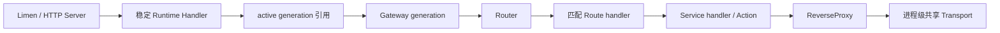
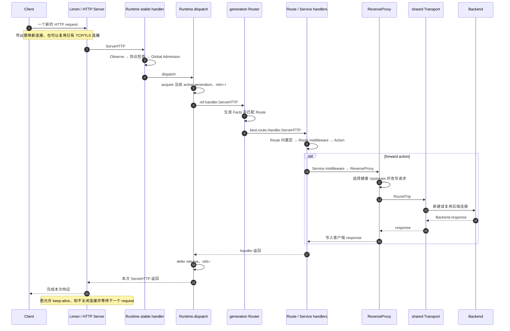
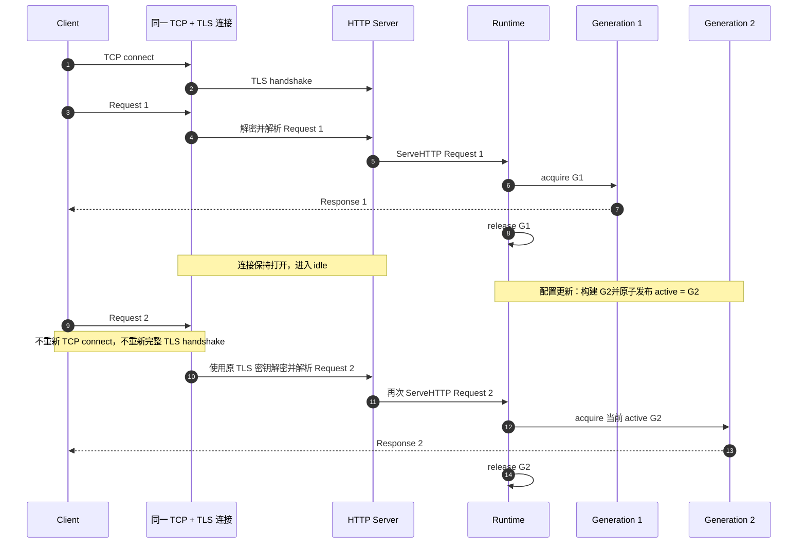

# Janus 请求栈、Keep-Alive、TLS 与配置热更新

本文把当前代码中的启动构建、入站连接、单次请求、HTTP/SSE 分流、配置热更新和后端连接池串成一条完整链路，重点回答两个问题：

1. 为什么配置更新后，同一条客户端 Keep-Alive TCP 连接上的后续请求可以使用新配置；
2. 为什么 HTTPS Keep-Alive 通常只在连接建立时进行一次 TLS handshake，后续 HTTP 请求仍能安全复用该连接。

本文中的“入站”表示 Client → Janus，“出站”表示 Janus → Backend。这是两条独立的连接，不能把它们的 Keep-Alive 混在一起理解。

## 1. 先看完整结论

```text
启动时：
Config
  → Runtime 创建进程级 Transport
  → Gateway 构建一代 Service / Route / Router handler 图
  → Runtime 保存 active generation
  → Limen 把稳定的 Runtime 安装到 HTTP Server

连接建立时：
TCP Accept
  → 如果启用 TLS，则完成一次 TLS handshake
  → ALPN 选择 HTTP/1.1 或 HTTP/2

每个请求：
HTTP Server 从已有连接解析一个新 request
  → Runtime 全局中间件
  → dispatch 获取当时的 active generation
  → Router 匹配 Route
  → Route middleware / Action / Service
  → ReverseProxy 使用共享 Transport 请求 Backend
```

配置热更新替换的是 Runtime 中的 active generation，不会替换 Limen、Listener、HTTP Server 或 Runtime 自身。因此：

- 已经进入旧 generation 的请求继续在旧 generation 中执行；
- 同一条 Keep-Alive 连接上的下一个 HTTP 请求会再次调用 Runtime，并获取新 generation；
- 入站 TCP/TLS 连接不需要因为 Route 配置更新而断开；
- Runtime 的出站 `http.Transport` 也不随 generation 替换，所以符合复用条件的后端连接仍可继续使用。

## 2. 各组件真正负责什么

| 组件 | 生命周期 | 主要职责 |
| --- | --- | --- |
| Limen | 进程 / Listener 级 | TCP/UDP 监听、入站 TLS、HTTP/1/2/3 Server、连接跟踪和停机 |
| Runtime | 进程级 | 稳定 Handler、全局中间件、active generation 发布与引用计数、共享 Transport |
| Gateway | generation 级 | 根据一份配置构建 Service、Route middleware、Route 和 Router |
| Router | generation 级 | 为每个请求生成匹配事实，并选择一个 Route |
| Route handler | generation 级 | Route 内置中间件、配置中间件和终结 Action |
| ReverseProxy | Service / generation 级 | 选择目标、改写请求并调用共享 Transport |
| `http.Transport` | 进程级 | Janus 到 Backend 的连接建立、连接池和连接复用 |

`Gateway` 在这里主要是“构建器 + 一代资源容器”，不是 Router 匹配完以后才进入的下一层。生产路径中，Runtime 保存的是 `Gateway.Handler()` 返回的 Router handler。

## 3. 启动时如何组装请求栈

### 3.1 Runtime 先构建第一代 Gateway

`internal/runtime/runtime.go` 的 `NewWithBuilder` 完成以下工作：

1. 用 `proxy.NewTransport` 创建一个进程级出站 Transport；
2. 创建进程级 metrics、全局 Admission 和 service limiter registry；
3. 调用 generation builder 构建第一代 Gateway；
4. 保存 `active generation`；
5. 构建稳定的全局 handler 链：

```text
Observe
  → RejectUnsupportedProtocols
    → Global Admission
      → Runtime.dispatch
```

这个 handler 在 Runtime 生命周期内保持不变。热更新只替换它内部将要取得的 active generation。

### 3.2 Gateway 构建 generation 内的 Handler 图

`internal/gateway/gateway.go` 的 `NewWithDiscovery` 大致按下面顺序构建：

```text
每个 Service：
Upstream / Discovery Pool
  → ReverseProxy
  → Service middleware
  → services[name]

每个 Route：
引用 services[name] 或创建 respond / redirect / static action
  → Route 配置 middleware
  → Route 固定内置 middleware
  → RouteMetadata
  → router.Route{Handler: routeHandler}

全部 Route：
router.New(routes)
  → Gateway.handler
```

Runtime 构建 generation 时调用 `Gateway.Handler()`，取得的就是这个 Router，而不是 Gateway 的 standalone 全局链。

### 3.3 Limen 把稳定 Runtime 安装进 Server

`cmd/janus/main.go` 创建 Limen 时传入的是同一个进程级 Runtime：

```go
limen.NewBinding(name, binding, requestRuntime, settings)
```

`NewBinding` 给请求附加可信 Limen ID，然后把 handler 放入：

```go
http.Server{Handler: handler}
```

因此对象关系是：



## 4. TCP Listener、TLS Listener 和 HTTP Server 的关系

`Limen.Listen()` 只绑定原始 TCP 地址：

```go
net.Listen("tcp", l.address)
```

`Limen.Serve()` 再逐层包装：

```text
原始 TCP listener
  → trackingListener
  → tls.NewListener            仅 TLS Limen 存在
  → http.Server.Serve
```

对应的核心代码在 `internal/limen/limen.go`：

```go
listener = &trackingListener{Listener: listener, owner: l}
if l.tls != nil {
    listener = tls.NewListener(listener, l.tls)
}
return l.server.Serve(listener)
```

`tls.NewListener` 本身不是“立刻对所有连接做握手”。它返回一个包装 Listener。对每条新 TCP 连接：

1. 底层 Listener `Accept` 得到一个 `net.Conn`；
2. TLS Listener 把它包装成服务端 `tls.Conn`；
3. HTTP Server 为该连接启动处理流程；
4. Go `net/http` 的 `conn.serve` 显式调用 `tlsConn.HandshakeContext(ctx)` 完成 handshake；
5. handshake 协商证书、密钥和 ALPN；
6. HTTP Server 随后在这个 `tls.Conn` 上解析 HTTP 数据。

启用 HTTP/1 和 HTTP/2 时，TLS 配置的 ALPN 列表包含 `http/1.1` 和/或 `h2`。握手决定这条连接后续使用哪个 HTTP 协议。

HTTP/3 不经过 `tls.NewListener`。它使用 UDP/QUIC，TLS 1.3 握手集成在 QUIC 连接建立过程中，但“连接建立一次、连接内承载多个请求 stream”的总体原则相同。

## 5. HTTPS Keep-Alive 为什么只握手一次

### 5.1 TLS Listener 只接受新连接

第一条请求到达时：

```text
TCP connect
  → tls.Listener.Accept 返回 tls.Conn
  → HTTP Server 显式调用 HandshakeContext 完成 TLS handshake
  → 得到可持续读写的 tls.Conn
  → 解析 Request 1
```

响应完成后，只要双方都没有关闭连接，HTTP Server 仍持有同一个 `tls.Conn`。第二个请求是同一连接中的后续应用数据：

```text
Request 2 字节
  → 使用已经协商好的 TLS 密钥封装成 TLS records
  → 原 TCP 连接
  → 服务端 tls.Conn 解密
  → HTTP Server 解析 Request 2
```

第二个请求仍然受到 TLS 保护，只是不再执行完整 handshake。它也不会再次经过 `tls.Listener.Accept`，因为没有新建 TCP 连接。

### 5.2 HTTP/1.1 Server 的概念性循环

下面是用于理解的简化伪代码，不是 Janus 自己实现的循环；实际循环位于 Go `net/http`：

```go
conn := listener.Accept() // 一条 TCP 连接只 Accept 一次；TLS Listener 返回 tls.Conn
if tlsConn, ok := conn.(*tls.Conn); ok {
    if err := tlsConn.HandshakeContext(ctx); err != nil {
        conn.Close()
        return
    }
    // 握手后按 ALPN 转交 HTTP/2；下面的循环只示意 HTTP/1.1。
}

for {
    // 握手已经完成；后续请求不会重新握手。
    req, err := readHTTPRequest(conn)
    if err != nil {
        conn.Close()
        return
    }

    serverHandler.ServeHTTP(responseWriter, req)
    finishResponse()

    if requestOrResponseRequiresClose() {
        conn.Close()
        return
    }

    waitForNextRequest(serverIdleTimeout)
}
```

TLS 本身也支持首次 `Read` / `Write` 时隐式握手，但 Janus 使用的 Go HTTP Server 会在解析 HTTP 请求前显式握手。这个区别不改变 Keep-Alive 复用结论。上述伪代码省略了 Accept 的错误处理和启动连接 goroutine 等细节。

这里的关键是两个不同的循环层次：

- Listener 的 Accept 循环负责得到“新连接”；
- 每个 HTTP/1.1 连接内部的请求循环负责得到“同连接上的下一个请求”。

Janus 的 Runtime 位于 `serverHandler.ServeHTTP` 位置，所以每个请求都会重新进入 Runtime。

### 5.3 响应结束不等于 TCP 连接结束

HTTP/1.1 使用消息边界告诉客户端响应在哪里结束，例如：

- `Content-Length`；
- `Transfer-Encoding: chunked`；
- HEAD、204、304 等协议规定的无 body 响应。

客户端读到当前响应的边界后，可以在相同连接上继续发送下一个请求。TCP socket 只有在发送 FIN/RST、发生错误、超过空闲时间或协议要求关闭时才结束。

常见的不能继续复用的情况包括：

- 请求或响应要求 `Connection: close`；
- `server.idle_timeout` 到期；
- HTTP 解析、TLS 或底层 TCP 发生错误；
- Janus shutdown/force close；
- HTTP/1.1 WebSocket Upgrade 后连接被 hijack，不再回到普通 HTTP 请求循环。

## 6. 每个请求进入 Janus 后的真实调用链



Runtime 的生产请求并不会调用 `Gateway.ServeHTTP()`。`Runtime.buildGeneration` 取得 `Gateway.Handler()`，把 Router 存进 `generationRef.handler`；`dispatch` 直接调用这个 handler。

## 7. HTTP、SSE 和 WebSocket 在哪里分流

在 Listener 和 HTTP Server 看来，它们最初都是 HTTP 请求。Router 的 `requestFacts` 按以下优先级生成应用协议事实：

```text
IsWebSocketRequest == true → websocket
否则 WantsSSE == true     → sse
否则                       → http
```

Router 用这个值计算 `Protocol(...)` 规则。Route 选定后，请求仍然走同一套固定内置 middleware；`Timeout`、`StreamTimeout` 和 `ClearStreamingWriteDeadline` 分别调用相同判断函数来选择行为。

特别需要注意：

- 一个普通 HTTP 请求执行完毕后，连接可以回到 idle 状态并承载下一请求；
- 一个 SSE response 是一个长期不返回的 HTTP 请求，它持续占用一次 generation 引用和 Admission 许可；
- reload 不会让正在进行的 SSE 在中途切到新 generation；
- 断开 SSE 后发起的新请求才会重新 acquire 当时的 active generation；
- HTTP/2/3 中，同一连接上的另一个 stream 可以在旧 SSE 仍运行时获取新 generation。

更完整的超时和协议分支图见 [request-timeouts.md](./request-timeouts.md) 与 [不同类型请求的参数原理分布解析.md](./不同类型请求的参数原理分布解析.md)。

## 8. 配置热更新为什么不打断入站 Keep-Alive

### 8.1 Replace 替换什么，不替换什么

`Runtime.replace` 会拒绝在热更新中改变 startup-owned 配置，包括 Limen bindings 和全局 Settings。成功 reload 的核心过程是：

```text
验证新配置
  → 使用同一个共享 Transport 构建 candidate Gateway generation
  → candidate 构建成功后短暂加锁
  → active = candidate
  → old generation 标记 retired
  → old refs 降到 0 后关闭 old generation 资源
```

它不会执行以下操作：

- 不重建 TCP Listener；
- 不替换 `http.Server.Handler` 中的 Runtime；
- 不关闭现有入站 TCP/TLS 连接；
- 不对 HTTP/2 发送仅由路由 reload 引起的连接级关闭；
- 不关闭进程级共享 Transport 的空闲连接。

所以连接和路由代次是正交的：连接属于 Limen/Server，generation 属于 Runtime 的单次请求调度。

### 8.2 同一条 HTTP/1.1 Keep-Alive 连接跨 reload



因此“复用了旧 TCP 通道”和“使用了新配置”并不矛盾。TCP/TLS 连接决定字节如何传输；Runtime generation 决定这一次 HTTP 请求由哪张 handler 图处理。

### 8.3 reload 发生在旧请求执行中间

如果 Request 1 尚未返回时发布 G2：

```text
Request 1 已 acquire G1 → 始终使用 G1，直到 handler 返回
新 Request / 新 H2-H3 stream → acquire G2
G1 被标记 retired，但 refs > 0 → 暂不关闭
Request 1 返回并 release → refs == 0 → 关闭 G1 拥有的资源
```

这避免了请求执行到一半时 Route、middleware、健康检查或 discovery lease 被释放。

## 9. 证书热更新和 Route 热更新不是一回事

TLS 配置的 `GetCertificate` 从原子指针读取当前证书。证书轮换只更新这个指针：

```text
已有 TLS 连接：继续使用建立连接时的握手结果
新 TCP/TLS 连接：下一次 handshake 读取新证书
```

已有连接不会因为证书内容更新而自动重新 handshake。相反，Route reload 是按 HTTP 请求 acquire generation，因此已有连接上的后续请求可以立即使用新 Route generation。

这两种“新旧边界”不同：

| 更新内容 | 生效边界 |
| --- | --- |
| Route / Service / middleware generation | 下一个进入 `Runtime.dispatch` 的请求或 stream |
| TLS 证书内容 | 下一个新 TLS handshake |
| Listener、协议、全局 Settings、Backend Transport 设置 | 当前实现要求重启 |

## 10. 为什么后端 TCP 连接也可能跨 generation 复用

Runtime 在启动时只创建一个 `http.Transport`：

```go
transport := proxy.NewTransport(c.Settings.Backend)
```

构建每一代 Gateway 时，Runtime 都把同一个 Transport 注入 Service 的 ReverseProxy。`Runtime.replace` 使用的仍是 `r.transport`。generation 退休时，Gateway 只关闭自己拥有的 discovery lease、health checker 等资源；Runtime 注入的 Transport 不属于 Gateway，因此不会随旧 generation 关闭。

出站请求路径是：

```text
新 generation 的 Router / Route
  → 新 generation 的 Service pool 选择 target URL
  → 新 generation 的 ReverseProxy
  → 同一个进程级 http.Transport
  → 从连接池取连接或新建连接
```

如果新旧 generation 最终选择相同、且连接池认为兼容的后端目标，Transport 可以取出旧 generation 留下的 idle connection。若目标的 scheme、host、port 或其他连接条件不同，则会为新目标建立连接；旧目标的 idle connection 只会等待超时、被显式清理或在 Runtime 关闭时清理。

常见更新的结果可以这样判断：

| 更新场景 | 入站 Client → Janus | 出站 Janus → Backend |
| --- | --- | --- |
| 只修改 Route / middleware | 现有连接继续使用；下个请求取得新 generation | 目标相同则可能复用已有池连接 |
| 把 upstream 改成不同 host 或 port | 入站连接不受影响 | 新目标建立新连接；旧目标连接暂留池中直到回收 |
| upstream hostname 不变，但 DNS 指向改变 | 入站连接不受影响 | 已有连接仍可能连着旧 IP；只有需要新建连接时才重新解析 |
| 修改 Backend Transport 设置 | 当前热更新拒绝 | 需要重启后创建新 Transport |
| 轮换入站证书内容 | 已有 TLS 连接保持；新 handshake 使用新证书 | 无直接影响 |

对于 HTTPS Backend，规则与入站类似：复用已有 TLS connection 时不重新完整 handshake；只有建立新的后端连接时才受 `TLSHandshakeTimeout` 约束。

还要区分两个名字相似的配置：

| 概念 | Janus 配置 / 实现 | 含义 |
| --- | --- | --- |
| HTTP Keep-Alive / 连接池复用 | `http.Transport` 自动管理，受 `MaxIdleConns*`、`MaxConnsPerHost`、`IdleConnTimeout` 等影响 | 一个 HTTP 连接承载多个请求 |
| TCP keepalive probe | `backend.keep_alive` → `net.Dialer.KeepAlive` | 操作系统探测空闲 TCP 对端是否仍存活，不是 HTTP 连接池空闲寿命 |

## 11. HTTP/1.1、HTTP/2、HTTP/3 的差异

| 协议 | 一个连接如何承载多个请求 | reload 后如何选 generation |
| --- | --- | --- |
| HTTP/1.1 | Keep-Alive 连接上通常顺序处理请求 | 每次调用 Handler 时重新 acquire |
| HTTP/2 | 同一 TCP/TLS 连接上多个并发 stream | 每个 stream 对应一次 Handler 调用并各自 acquire |
| HTTP/3 | 同一 QUIC 连接上多个并发 stream | 每个 stream 对应一次 Handler 调用并各自 acquire |

所以 HTTP/2/3 下甚至可能同时存在：

```text
同一连接
  ├─ Stream A：reload 前已进入，使用旧 generation
  └─ Stream B：reload 后才进入，使用新 generation
```

连接不绑定 generation，请求/stream 才绑定 generation。

## 12. 结合代码定位

| 问题 | 代码位置 |
| --- | --- |
| Runtime 创建共享 Transport 和稳定全局链 | `internal/runtime/runtime.go`: `NewWithBuilder` |
| 每个请求获取 / 释放 generation | `internal/runtime/runtime.go`: `dispatch`、`acquire`、`release` |
| candidate 构建和 active swap | `internal/runtime/runtime.go`: `replace`、`buildGeneration` |
| Gateway 构建 Service、Route 和 Router | `internal/gateway/gateway.go`: `NewWithDiscovery` |
| Router 判断 http/sse/websocket 并匹配 | `internal/router/router.go`: `ServeHTTP`、`requestFacts` |
| 请求类型判断条件 | `internal/protocol/context.go`: `IsWebSocketRequest`、`WantsSSE` |
| TCP Listener 和 TLS Listener 包装 | `internal/limen/limen.go`: `Listen`、`Serve` |
| TLS 证书按新 handshake 读取 | `internal/limen/limen.go`: `serverTLSConfig`、`RotateCertificate` |
| 后端连接池配置 | `internal/proxy/proxy.go`: `NewTransport` |
| ReverseProxy 选择 target 并 RoundTrip | `internal/proxy/proxy.go`: `NewWithForwarding` |
| 稳定 Handler 与 Transport 跨代复用测试 | `internal/runtime/runtime_test.go`: `TestRuntimeKeepsStableHandlerAcrossReplacement` |
| 旧请求等待完成后再关闭旧代测试 | `internal/runtime/runtime_test.go`: generation drain 相关测试 |
| HTTP/3 旧 stream / 新请求跨 reload | `internal/runtime/http3_reload_test.go`: `TestHTTP3ReloadKeepsOldStreamOnOldGeneration` |

## 13. 最短记忆模型

```text
Listener 接受连接；TLS 为连接握手；HTTP Server 从连接读取多个请求；
Runtime 为每个请求选择 generation；Router 为请求选择 Route；
Gateway 负责构建这些 handler；Transport 负责到后端的连接池。
```

因此：

```text
同一 TCP/TLS 连接 + 后续新 HTTP 请求
    完全可以
使用新发布的 Route generation
```

而一个已经开始的请求，包括一个持续数小时的 SSE 请求，不会在中途切换 generation。
