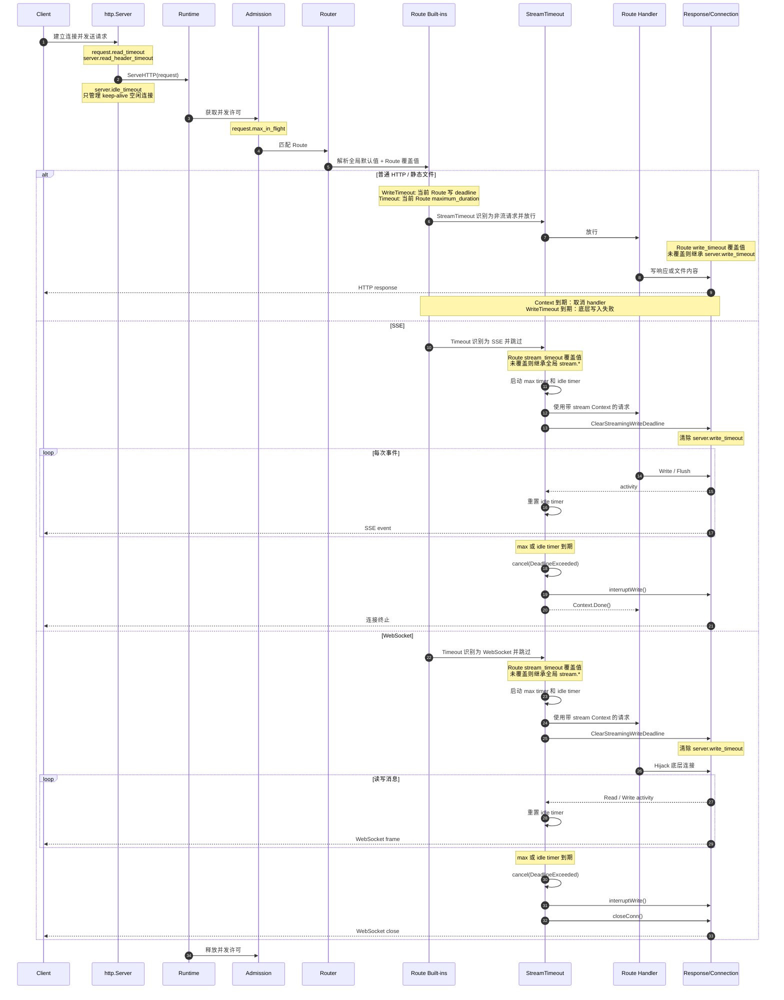

# 请求分类与超时模型

本文说明 Janus 如何区分普通 HTTP、SSE、WebSocket，以及每一类请求实际使用哪些超时参数。

## 先看结论

当前请求链把进程级和 Route 级内置 middleware 分开：

```text
请求
  ↓
Observe（全局）
  ↓
RejectUnsupportedProtocols（全局）
  ↓
Admission（全局总并发）
  ↓
Router 匹配 Route
  ↓
Admission（仅 Route 配置覆盖时）
  ↓
WriteTimeout → Timeout → StreamTimeout → ClearStreamingWriteDeadline
  ↓
Route 配置中间件 → Action
```

它们分别位于：

- `internal/middleware/timeout.go`
- `internal/middleware/stream_timeout.go`
- `internal/middleware/streaming.go`

全局链安装在 `internal/runtime/runtime.go`，Route 链安装在
`internal/gateway/gateway.go`。超时 middleware 必须位于路由匹配之后，
才能读取当前 Route 的 `builtin_middleware_overrides`。

## 总体时序图

下面的图把参数的使用者和生命周期放在同一条请求链路中。`http.Server` 的参数发生在 middleware 之前或连接层；middleware 参数发生在 Runtime handler 内部。



图中的关键点：

- `request.read_timeout`、`server.read_header_timeout`、`server.idle_timeout`、`server.write_timeout` 是 `http.Server` 或连接层参数，不是普通 timeout middleware 的参数。
- `request.maximum_duration` 是 Route `Timeout` 的全局默认值，Route 可以覆盖。
- `stream.max_duration` 和 `stream.idle_timeout` 是 Route `StreamTimeout` 的全局默认值，Route 可以覆盖。
- `server.write_timeout` 先由 `http.Server` 设置，Route `WriteTimeout` 随后可以重设当前响应的写 deadline。
- SSE/WebSocket 清除的是 `server.write_timeout`，不会清除 `stream.max_duration` 或 `stream.idle_timeout`。
- 静态文件是普通 HTTP 分支，不会自动进入 `StreamTimeout`。

## 请求如何分类

请求分类发生在 `internal/protocol/context.go`。

### WebSocket

当前实现识别以下条件同时成立的请求：

- 方法是 `GET`；
- HTTP 版本是 HTTP/1.x；
- `Connection` 包含 `Upgrade` token；
- `Upgrade: websocket`。

HTTP/2 extended CONNECT 目前不会被识别为 WebSocket。

### SSE

当前实现识别以下条件同时成立的请求：

- 方法是 `GET`；
- `Accept` 请求头中包含 `text/event-stream`。

例如：

```http
GET /events HTTP/1.1
Accept: text/event-stream
```

### 普通 HTTP

既不是 WebSocket、也不是 SSE 的请求，都会进入普通 HTTP 分支。包括：

- 普通 API 请求；
- HTML、JS、CSS、图片等静态文件请求；
- 普通文件下载；
- 没有 `Accept: text/event-stream` 的长轮询请求。

因此，static route 不会自动获得 SSE 或 WebSocket 的长连接策略。

## 参数归属总表

最容易混淆的是：配置参数不一定由 middleware 使用。下面按“谁读取这个参数”区分。

### 由 middleware 直接使用的参数

| 参数 | 使用 middleware | 适用请求 | 作用 |
| --- | --- | --- | --- |
| `request.maximum_duration` / Route 覆盖值 | `middleware.Timeout` | 普通 HTTP | 创建当前 Route 请求的 Context deadline |
| `request.max_in_flight` | `middleware.Admission` | 所有请求 | 限制整个 Runtime 的总并发 |
| Route `admission.max_in_flight` | `middleware.Admission` | 当前 Route | 在全局总限制之内增加 Route 独立并发限制 |
| `stream.max_duration` / Route 覆盖值 | `middleware.StreamTimeout` | SSE / WebSocket | 流连接的最大生命周期 |
| `stream.idle_timeout` / Route 覆盖值 | `middleware.StreamTimeout` | SSE / WebSocket | 连续没有读写活动的最大时间 |
| Route `write_timeout.timeout` | `middleware.WriteTimeout` | 当前 Route | 重设当前响应的底层写入 deadline |

### 不由 middleware 直接使用的参数

| 参数 | 使用层 | 作用 |
| --- | --- | --- |
| `request.read_timeout` | `http.Server.ReadTimeout` | 读取请求头和请求体的时间预算 |
| `server.read_header_timeout` | `http.Server.ReadHeaderTimeout` | 只限制读取请求头 |
| `server.write_timeout` | `http.Server.WriteTimeout` | 普通响应写入 deadline 的全局默认值，Route 匹配后可被 `WriteTimeout` 重设 |
| `server.idle_timeout` | `http.Server.IdleTimeout` | keep-alive 连接没有新请求时的空闲时间 |
| `server.max_header_bytes` | `http.Server.MaxHeaderBytes` | 请求头大小上限 |
| `backend.*` | `http.Transport` / Proxy | Janus 访问上游服务的连接参数，不控制客户端到 Janus 的请求 |
| `shutdown.*` | Limen / Runtime shutdown | 进程关闭和连接排空，不控制正常请求生命周期 |

### middleware 会间接影响的参数

`middleware.ClearStreamingWriteDeadline` 不读取一个独立配置参数。它会在 SSE/WebSocket 请求上调用：

```go
http.NewResponseController(w).SetWriteDeadline(time.Time{})
```

因此它会清除 `server.write_timeout` 对这两类请求设置的写入 deadline。这个参数仍然由 `http.Server` 设置，只是随后被 streaming middleware 清除了。

`request.maximum_duration` 和 `server.write_timeout` 不是同一个概念：

- Context timeout 控制 handler 是否应该结束；
- write deadline 控制底层连接还能否继续写数据。

简化判断：

```text
request.maximum_duration  → middleware.Timeout
stream.*                  → middleware.StreamTimeout
request.read_timeout      → http.Server
server.*                  → http.Server
```

## 普通 HTTP 的生命周期

普通 HTTP 请求会经过 `middleware.Timeout`：

```go
ctx, cancel := context.WithTimeout(r.Context(), maximumDuration)
next.ServeHTTP(w, r.WithContext(ctx))
```

当时间到期时，Context 被取消。下游 handler、代理或业务代码需要监听：

```go
<-r.Context().Done()
```

需要注意：普通 `middleware.Timeout` 本身不会自动调用
`SetWriteDeadline`，所以它主要是协作式取消。如果 handler 忽略 Context，或者已经阻塞在底层网络写入中，不能只依赖这个 middleware 强制中断。

静态文件也属于普通 HTTP，因此当前默认同时受：

```text
request.maximum_duration
server.write_timeout
```

限制。代码没有针对静态文件设置带宽上限。

## SSE 的生命周期

SSE 会跳过普通 `middleware.Timeout`，进入 `StreamTimeout`：

```json
{
  "stream": {
    "max_duration": "20h",
    "idle_timeout": "5m"
  }
}
```

### `max_duration`

`StreamTimeout` 会启动一个 max timer。计时器到期时会：

1. 将请求标记为超时；
2. 用 `context.DeadlineExceeded` 取消请求 Context；
3. 如果当前正在写数据，立即打断写入；
4. 让后续写入失败；
5. 终止已经提交响应的 SSE 请求。

### `idle_timeout`

每次 SSE 写入或 flush 成功后，middleware 会刷新 idle timer。

因此：

```text
max_duration  = 从连接建立开始计算的总生命周期
idle_timeout  = 两次 SSE 活动之间允许的最大静默时间
```

如果 SSE 20 小时内可能长时间没有事件，`idle_timeout` 也必须设置得足够大。

## WebSocket 的生命周期

WebSocket 也跳过普通 `middleware.Timeout`，使用 `StreamTimeout`。

WebSocket 完成 hijack 后，middleware 会保存底层连接。`max_duration` 或 `idle_timeout` 到期时，直接关闭这个连接。

WebSocket 的读写都会刷新 activity，因此一个持续有消息的连接不会触发 idle timeout，但仍然会受到 `max_duration` 限制。

## `server.write_timeout` 为什么对 SSE/WebSocket 不生效

`middleware.ClearStreamingWriteDeadline` 对 SSE 和 WebSocket 执行：

```go
http.NewResponseController(w).SetWriteDeadline(time.Time{})
```

这会清除 `http.Server.WriteTimeout` 设置的普通响应写入 deadline。

但它不会清除：

- `stream.max_duration`；
- `stream.idle_timeout`；
- 请求 Context 的取消状态。

所以 SSE/WebSocket 的写入 deadline 由 `StreamTimeout` 自己控制，而普通 HTTP 仍然使用 `server.write_timeout`。

## 推荐的全局上限配置

如果把全局普通请求上限设置为 24 小时，配置关系应类似：

```json
{
  "request": {
    "maximum_duration": "24h"
  },
  "stream": {
    "max_duration": "20h",
    "idle_timeout": "5m"
  },
  "server": {
    "write_timeout": "24h5s"
  }
}
```

`server.write_timeout` 必须大于 `request.maximum_duration`，因此不能两个都设置为正好 `24h`。

这段配置中：

- `request.maximum_duration` 被 `middleware.Timeout` 使用；
- `stream.max_duration` 和 `stream.idle_timeout` 被 `middleware.StreamTimeout` 使用；
- `server.write_timeout` 不属于 middleware，而是 `http.Server` 的底层写入限制；
- SSE/WebSocket 进入 `ClearStreamingWriteDeadline` 后，会清除这个底层写入限制。

## Route 级内置参数覆盖

覆盖配置直接属于某个 Route，不会写入用户中间件数组：

```json
{
  "name": "api",
  "match": "PathPrefix(`/api`)",
  "builtin_middleware_overrides": {
    "timeout": { "maximum_duration": "15s" },
    "admission": { "max_in_flight": 64 },
    "stream_timeout": {
      "max_duration": "20h",
      "idle_timeout": "30m"
    },
    "write_timeout": { "timeout": "20s" }
  },
  "action": { "forward": { "service": "api" } }
}
```

每个字段都可以单独省略。`timeout`、`stream_timeout` 和 `write_timeout`
省略时继承对应的全局设置；`admission.max_in_flight` 省略时不增加 Route
独立并发闸门，但全局 Admission 仍然生效。Route 的 `max_in_flight` 是额外的
Route 限制，不会替换全局总并发限制，因此不能大于全局
`request.max_in_flight`。Route 的有效 `write_timeout.timeout`
必须大于有效 `timeout.maximum_duration`，并且不能超过
`shutdown.drain_timeout`。

管理画布里的内置层不能删除或调整顺序。带“参数可修改”标记的内置层可以
直接覆盖当前 Route 的参数；普通 HTTP、SSE、WebSocket 视图会分别标记当前
实际生效和旁路的层。

## 如何实现“API 15 秒、SSE/WebSocket 20 小时、文件下载 24 小时”

目标策略是：

```text
API                  15s
SSE                  20h
WebSocket            20h
静态文件下载          24h
```

把全局普通请求和写入上限设为文件下载所需的较大值，然后分别在 API、
SSE/WebSocket Route 上覆盖即可。API Route 使用 `maximum_duration: 15s`
和大于 15 秒的 `write_timeout.timeout`；流 Route 使用
`stream_timeout.max_duration: 20h`。静态文件 Route 不配置覆盖，继续继承全局值。

## 常见误解

### `Cache-Control` 会控制下载速度吗？

不会。`Cache-Control` 主要控制浏览器是否缓存或重新请求，不能限制或提升单次下载的网络速度。

### `server.idle_timeout` 是 SSE 的最大时间吗？

不是。它控制 keep-alive 连接的空闲时间。SSE 的最大生命周期由 `stream.max_duration` 控制。

### `request.maximum_duration` 会直接关闭所有底层连接吗？

普通 HTTP 下它主要取消 Context；SSE/WebSocket 则由 `StreamTimeout` 额外负责打断写入和关闭连接。
