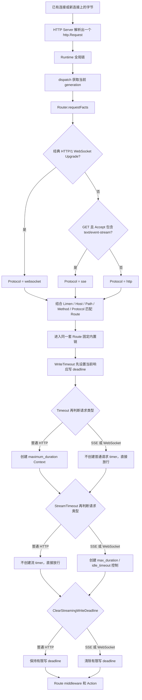
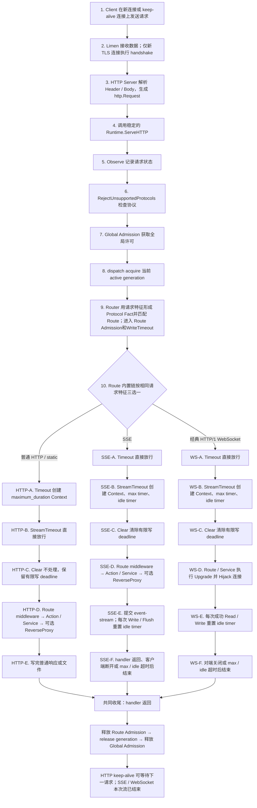
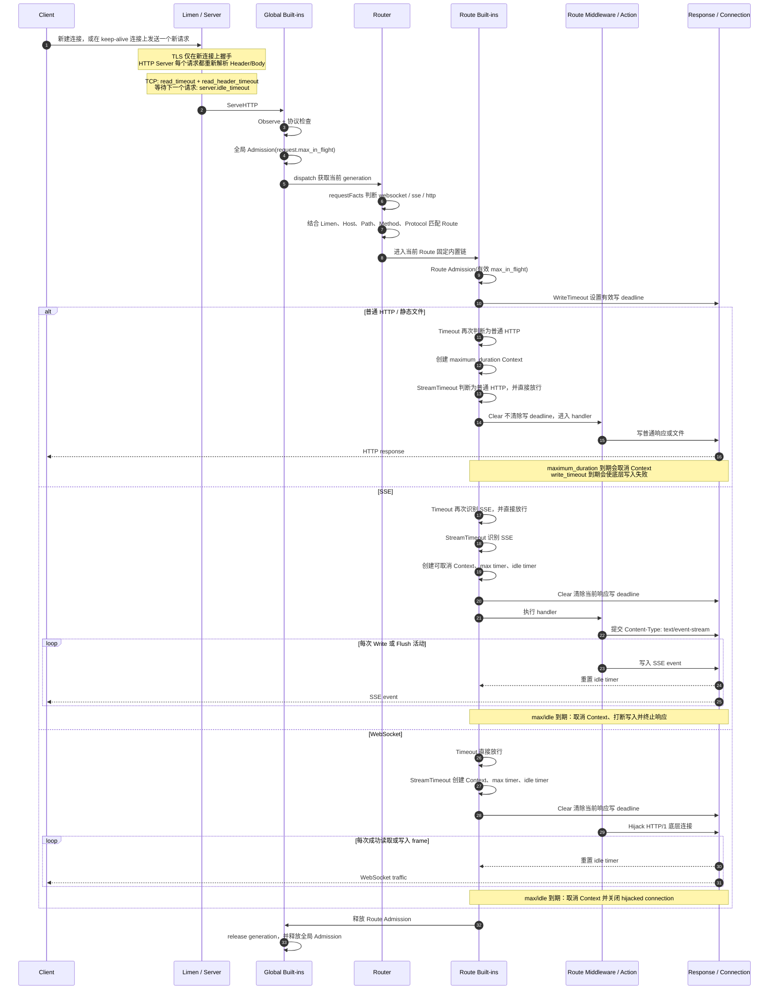

# 请求分类、并发与超时模型

本文以当前实现为准，说明 Janus 从接收连接到执行 Route action 的完整链路，以及 HTTP、静态文件、SSE、WebSocket 分别受哪些参数控制。

如果需要先理解 Listener、TLS handshake、HTTP Keep-Alive、Runtime generation 和后端连接池之间的关系，见 [Janus 请求栈、Keep-Alive、TLS 与配置热更新](./request-stack-keepalive-reload.md)。

相关实现主要位于：

- `internal/limen/limen.go`
- `internal/runtime/runtime.go`
- `internal/gateway/gateway.go`
- `internal/protocol/context.go`
- `internal/middleware/admission.go`
- `internal/middleware/write_timeout.go`
- `internal/middleware/timeout.go`
- `internal/middleware/stream_timeout.go`
- `internal/middleware/streaming.go`

## 先看结论

Janus 没有一个独立的“请求分类 middleware”。Router 和各个内置 middleware 都使用 `internal/protocol/context.go` 中的同一组判断函数：

- `protocol.IsWebSocketRequest(r)` 判断经典 HTTP/1.1 WebSocket Upgrade；
- `protocol.WantsSSE(r)` 判断 SSE；
- 两者都不匹配时按普通 HTTP 处理。

每个匹配到的 Route 都有同一套固定内置链，只是部分 middleware 对当前协议会直接放行：

```text
Limen / http.Server
  └─ Observe                         全部请求生效
     └─ RejectUnsupportedProtocols  全部请求生效
        └─ Admission                全局总并发，全部请求生效
           └─ Router               匹配 Route
              └─ RouteMetadata
                 └─ Admission      当前 Route 并发，全部请求生效
                    └─ WriteTimeout            先设置当前响应的写 deadline
                       └─ Timeout              仅普通 HTTP 生效
                          └─ StreamTimeout      仅 SSE / WebSocket 生效
                             └─ ClearStreamingWriteDeadline
                                └─ Route 配置的 middleware
                                   └─ Action / Service middleware
```

这里有两个 Admission，职责不同：

- 全局 Admission 使用 `request.max_in_flight`，限制整个 Janus 实例的总并发；
- Route Admission 使用当前 Route 的有效 `max_in_flight`，限制单个 Route 的并发。

Route 没有显式覆盖时，Route Admission 的上限继承 `request.max_in_flight`。它仍然存在，但全局 Admission 依然会限制所有 Route 的并发总和。

## 参数由谁使用

配置字段所在的 JSON 分组不等于它的执行层。例如 `request.read_timeout` 位于 `request` 下，但它由服务器层读取，并不是 `Timeout` middleware 的参数。

| 参数 | 直接使用者 | 作用范围 | 含义 |
| --- | --- | --- | --- |
| `request.read_timeout` | TCP `http.Server.ReadTimeout` | HTTP/1、HTTP/2、h2c 的请求读取 | 从接受连接后开始计算的请求读取预算，包含 Header 和 Body |
| `server.read_header_timeout` | TCP `http.Server.ReadHeaderTimeout` | HTTP/1、HTTP/2、h2c 的 Header 读取 | 只限制读取请求头 |
| `server.idle_timeout` | TCP `http.Server.IdleTimeout`；HTTP/3 server 的 `IdleTimeout` | 连接层 | keep-alive 等待下一次请求的空闲时间；不是 SSE 的空闲时间 |
| `server.max_header_bytes` | TCP/HTTP3 server | 连接层 | 请求头大小上限 |
| `request.max_in_flight` | 全局 `Admission` | 全部请求 | 整个 Runtime 的非等待式总并发上限，满载立即返回 503 |
| Route `admission.max_in_flight` | Route `Admission` | 当前 Route 的全部请求 | 当前 Route 的非等待式并发上限 |
| `request.maximum_duration` / Route 覆盖值 | `Timeout` | 普通 HTTP | 创建请求 Context deadline |
| `server.write_timeout` / Route 覆盖值 | Route `WriteTimeout` | 当前 Route | 设置当前响应的底层写 deadline |
| `stream.max_duration` / Route 覆盖值 | `StreamTimeout` | SSE、WebSocket | 流请求进入 middleware 后允许存在的最长总时间 |
| `stream.idle_timeout` / Route 覆盖值 | `StreamTimeout` | SSE、WebSocket | 两次被 Janus 观察到的流活动之间允许的最长静默时间 |
| `shutdown.drain_timeout` | 关闭流程 | 整个进程 | 停机时等待请求排空的上限，不是日常请求超时 |
| `backend.*` | `http.Transport` / Proxy | Janus 到上游 | 不控制客户端到 Janus 的连接 |

### HTTP/3 的差异

`request.read_timeout` 和 `server.read_header_timeout` 被安装到 Go 的 TCP `http.Server`，不直接安装到 `http3.Server`。HTTP/3 仍使用 `server.idle_timeout`、`server.max_header_bytes`，并在 Route 匹配后受到内置 timeout middleware 的约束。

`server.write_timeout` 对 TCP 请求既是 `http.Server.WriteTimeout`，又是 Route `WriteTimeout` 的默认值；HTTP/3 没有前一层 `http.Server.WriteTimeout`，但 Route `WriteTimeout` 仍会使用这个有效值设置当前响应 deadline。

## 哪个内置 middleware 对哪个协议生效

| 内置层 | 普通 HTTP / 静态文件 | SSE | WebSocket |
| --- | :---: | :---: | :---: |
| 全局 Admission | 生效 | 生效 | 生效 |
| Route Admission | 生效 | 生效 | 生效 |
| WriteTimeout | 生效 | 先设置，随后被 Clear 清除 | 先设置，随后被 Clear 清除 |
| Timeout | 生效 | 不生效，直接放行 | 不生效，直接放行 |
| StreamTimeout | 不生效，直接放行 | 生效 | 生效 |
| ClearStreamingWriteDeadline | 不生效，直接放行 | 生效 | 生效 |

“不生效”不是未安装或禁用。所有 Route 都有同一套固定内置链，只是 middleware 根据当前请求协议决定执行逻辑还是直接调用下一层。

## 请求如何分类

### WebSocket

以下条件必须同时成立：

- 方法为 `GET`；
- 请求是 HTTP/1.x；
- `Connection` 中包含 `Upgrade` token；
- `Upgrade: websocket`。

当前不支持把 HTTP/2 extended CONNECT 识别为 WebSocket。

### SSE

以下条件必须同时成立：

- 方法为 `GET`；
- `Accept` 请求头中包含 `text/event-stream`，参数和大小写不影响匹配。

```http
GET /events HTTP/1.1
Accept: text/event-stream
```

SSE 是普通 HTTP response 的流式写入形式，可以运行在项目支持的 HTTP 传输协议上。

### 普通 HTTP

既不是上述 WebSocket handshake、也没有声明 SSE 的请求都属于普通 HTTP，包括：

- 普通 API；
- HTML、JS、CSS、图片等静态资源；
- 普通文件下载；
- 没有 `Accept: text/event-stream` 的长轮询。

分类依据是请求方法和 Header，不是 Route action。`static` action 通常属于普通 HTTP，但它不会因为 action 类型自动获得独立的超时策略；如果要让文件下载拥有更长时间，应在该 Route 上覆盖参数。

## HTTP 与 SSE 到底在哪里分流

SSE 并没有在 Listener、TLS 或 `http.Server` 层切换成另一种服务器。对于这些层来说，普通 HTTP 和 SSE 都只是一个 `http.Request`；差异直到 Router 查看请求方法和 Header 时才出现。

代码没有生成一个永久保存的“请求类型”字段供后续所有层读取，而是在两个位置使用同一组判断函数：

1. Router 的 `requestFacts` 先调用 `IsWebSocketRequest` / `WantsSSE`，得到 `Facts.Protocol = http | sse | websocket`，供 `Protocol(...)` Route 规则选择 Route；
2. Route 选定后，`Timeout`、`StreamTimeout`、`ClearStreamingWriteDeadline` 再调用相同函数，决定当前 middleware 是执行控制逻辑还是直接 `next.ServeHTTP`。

因此图里的“分支”只是 handler 行为分支，不是 TCP 连接分支，也不是另开一个 SSE Server：



这里还有一个容易混淆的配置效果：如果 Route 写了 ``Protocol(`sse`)``，只有带正确 SSE 请求特征的请求才能匹配它；不带 `Accept: text/event-stream` 的同路径请求会被视为 `http`，需要另一个匹配普通 HTTP 的 Route，否则返回 404。Route 没写 `Protocol(...)` 时，它可以同时匹配普通 HTTP、SSE 和经典 WebSocket，后面的内置 middleware 仍会按请求实际特征选择各自行为。

## 完整执行流程图

下面的第 1–9 步是共同路径。第 10 步只做一次概念上的请求类型判断，然后进入三条**互斥**分支；HTTP 分支结束后不会继续进入 SSE，SSE 结束后也不会继续进入 WebSocket。代码中各 middleware 会独立重复相同判断，但执行效果等价于这张图。



### 补充时序图

下面保留时序图视角，便于观察 Client、Server、Runtime、Router 和 handler 之间的调用方向。`alt / else` 表示三条互斥路径；Mermaid 的自动编号会跨分支继续增加，但不表示 HTTP 分支结束后还会进入 SSE 或 WebSocket 分支。



## 普通 HTTP 和静态文件

`Timeout` 使用当前 Route 的有效 `maximum_duration`：

```go
ctx, cancel := context.WithTimeout(r.Context(), maximumDuration)
next.ServeHTTP(w, r.WithContext(ctx))
```

到期后 Context 被取消；如果请求仍在读取 Body，Janus 还会关闭 Body 以打断阻塞读取。下游 handler、ReverseProxy 或业务代码仍需要正确响应 `r.Context().Done()`。

`Timeout` 不会强行停止任意 Go 代码，也不会自行写入 504。已经忽略 Context 的 handler 不能只依赖它被强制结束。

`WriteTimeout` 则调用：

```go
http.NewResponseController(w).SetWriteDeadline(time.Now().Add(timeout))
```

它修改的是当前响应底层连接的写 deadline，不会修改全局配置，也不会永久影响其他请求。即使 Route 没有覆盖，该 middleware 也会用继承的 `server.write_timeout` 在 Route 匹配后重新设置当前响应的 deadline。

普通 HTTP（包括静态文件）同时受到这两个独立约束：

```text
有效 timeout.maximum_duration  → Context 生命周期
有效 write_timeout.timeout     → 底层响应写入期限
```

Janus 的 static action 没有内置带宽限制。`Cache-Control` 控制缓存和重验证，不控制单次下载速度。

## SSE 和 WebSocket

SSE/WebSocket 会绕过普通 `Timeout`，由 `StreamTimeout` 创建一个可取消 Context 和两个独立 timer：

- `max_duration` 从请求进入 `StreamTimeout` 开始计时，活动不会延长它；
- `idle_timeout` 在被 Janus 观察到流活动后重置。

SSE 的活动是成功的 `Write` 或 `Flush`。WebSocket 在 hijack 时记录一次活动，之后成功读取或写入底层连接都会重置 idle timer。

`ClearStreamingWriteDeadline` 随后执行：

```go
http.NewResponseController(w).SetWriteDeadline(time.Time{})
```

它只清除当前 SSE/WebSocket 响应的写 deadline，不修改 `http.Server` 配置，也不清除 `stream.max_duration`、`stream.idle_timeout` 或 Context 取消状态。

超时发生时：

- 请求 Context 以 `context.DeadlineExceeded` 为 cause 被取消；
- 正在进行的写操作会被打断；
- SSE 尚未提交响应头时可返回 504，已提交后中止响应；
- WebSocket 的 hijacked connection 被关闭。

## Route 级覆盖

内置参数覆盖直接属于 Route，不写入 `middlewares` 数组：

```json
{
  "name": "api",
  "match": "PathPrefix(`/api`)",
  "builtin_middleware_overrides": {
    "timeout": {
      "maximum_duration": "15s"
    },
    "admission": {
      "max_in_flight": 64
    },
    "stream_timeout": {
      "max_duration": "20h",
      "idle_timeout": "30m"
    },
    "write_timeout": {
      "timeout": "20s"
    }
  },
  "action": {
    "forward": {
      "service": "api"
    }
  }
}
```

每个字段都可单独省略，省略时继承对应全局值：

| Route 覆盖字段 | 全局默认来源 |
| --- | --- |
| `timeout.maximum_duration` | `request.maximum_duration` |
| `admission.max_in_flight` | `request.max_in_flight` |
| `stream_timeout.max_duration` | `stream.max_duration` |
| `stream_timeout.idle_timeout` | `stream.idle_timeout` |
| `write_timeout.timeout` | `server.write_timeout` |

有效配置还必须满足：

```text
Route admission.max_in_flight <= request.max_in_flight
stream_timeout.idle_timeout <= stream_timeout.max_duration
write_timeout.timeout > timeout.maximum_duration
write_timeout.timeout <= shutdown.drain_timeout
```

这些关系按“覆盖后 + 继承后”的最终有效值校验。因此只改 `timeout.maximum_duration` 时，也可能需要同步提高 `write_timeout.timeout` 和 `shutdown.drain_timeout`。

管理画布中的内置 middleware 不能删除或调整顺序；可覆盖参数，但覆盖不会在 `middlewares` 数组中生成一个用户 middleware。

## 配置示例：API 15 秒、流 20 小时、文件 24 小时

全局值可以按最长的普通文件请求设置，再由 Route 缩短 API 或调整流连接：

```json
{
  "settings": {
    "request": {
      "read_timeout": "24h",
      "maximum_duration": "24h",
      "max_in_flight": 1024
    },
    "stream": {
      "max_duration": "20h",
      "idle_timeout": "30m"
    },
    "server": {
      "read_header_timeout": "5s",
      "write_timeout": "24h5s",
      "idle_timeout": "60s"
    },
    "shutdown": {
      "drain_timeout": "24h5s"
    }
  },
  "routes": [
    {
      "name": "api",
      "match": "PathPrefix(`/api`) && Protocol(`http`)",
      "builtin_middleware_overrides": {
        "timeout": { "maximum_duration": "15s" },
        "write_timeout": { "timeout": "20s" }
      },
      "action": { "forward": { "service": "api" } }
    },
    {
      "name": "events",
      "match": "PathPrefix(`/events`) && Protocol(`sse`)",
      "builtin_middleware_overrides": {
        "stream_timeout": {
          "max_duration": "20h",
          "idle_timeout": "30m"
        }
      },
      "action": { "forward": { "service": "events" } }
    },
    {
      "name": "downloads",
      "match": "PathPrefix(`/downloads`) && Protocol(`http`)",
      "action": { "static": { "root": "./downloads" } }
    }
  ]
}
```

这里 downloads Route 没有覆盖，所以继承普通请求的 24 小时 Context 和 `24h5s` 写 deadline；events Route 使用 stream 参数，普通 `maximum_duration` 对它不生效。

## 常见误解

### `server.idle_timeout` 会关闭安静的 SSE 吗？

不会按“两次 SSE event 的间隔”计时。SSE 已经在处理同一个 response，不是在 keep-alive 状态等待下一次 request。流静默时间由 `stream.idle_timeout` 管理。

### `request.maximum_duration` 到期一定返回 504 吗？

不一定。普通 `Timeout` 负责取消 Context，不负责缓存响应或强制写 504。下游是否还能返回错误取决于它是否观察 Context、响应是否已经提交以及写 deadline 是否仍然可用。

### `server.write_timeout` 能在 middleware 中修改吗？

能修改当前响应的实际 deadline，不能修改 `http.Server.WriteTimeout` 这个配置字段。`ResponseController.SetWriteDeadline` 是针对当前请求/连接的运行时控制；同一 keep-alive 连接上的后续请求会由服务器和各自 Route 重新设置 deadline。

### Route Admission 会替代全局 Admission 吗？

不会。请求必须先获得全局许可，再在匹配 Route 后获得 Route 许可；任意一层满载都会立即返回 503。
