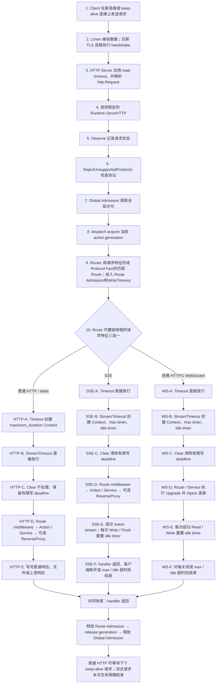
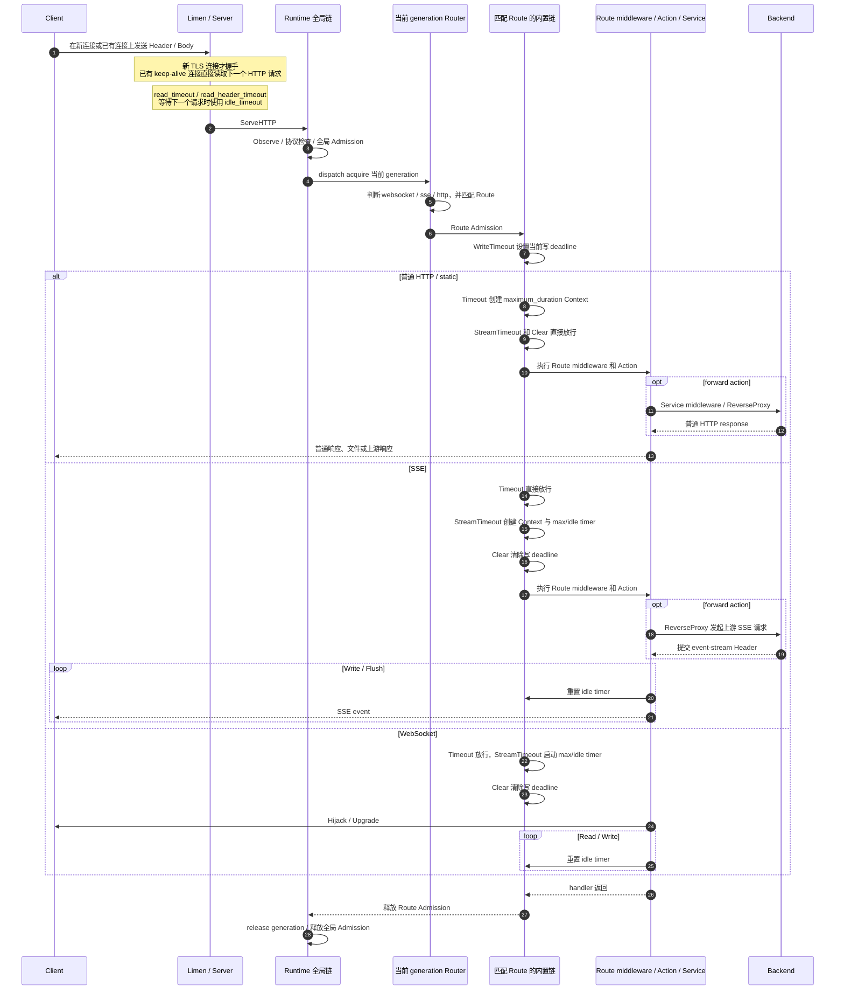

# 不同类型请求的参数、执行层与生命周期

这篇文档从“一次请求实际怎么走”来解释 Janus 的超时和并发参数。完整字段表和配置示例见 [request-timeouts.md](./request-timeouts.md)。

Listener、TLS handshake、HTTP Keep-Alive、generation 热更新和后端连接池的完整代码链路见 [Janus 请求栈、Keep-Alive、TLS 与配置热更新](./request-stack-keepalive-reload.md)。

## 1. 先区分三层

理解这些参数最重要的是不要只看它位于 JSON 的哪个分组，而要看是谁读取它。

### 第一层：Limen / Server

Limen 创建 TCP `http.Server` 时会设置：

```go
http.Server{
    ReadTimeout:       settings.Request.ReadTimeout.Duration(),
    ReadHeaderTimeout: settings.Server.ReadHeaderTimeout.Duration(),
    WriteTimeout:      settings.Server.WriteTimeout.Duration(),
    IdleTimeout:       settings.Server.IdleTimeout.Duration(),
    MaxHeaderBytes:    int(settings.Server.MaxHeaderBytes),
}
```

因此：

- `request.read_timeout` 虽然放在 `request` 分组中，实际是 Server 的请求读取时间；
- `server.read_header_timeout` 是只读取 Header 的时间；
- `server.write_timeout` 是 Server 对普通响应设置的初始写 deadline；
- `server.idle_timeout` 是 keep-alive 连接等待下一次 request 的时间；
- `server.max_header_bytes` 是 Header 大小上限。

`server.idle_timeout` 不是“一个 HTTP handler 最多能执行多久”，也不是“两个 SSE event 之间最多能间隔多久”。

HTTP/3 使用单独的 `http3.Server`：它直接使用 `server.idle_timeout` 和 `server.max_header_bytes`，但不会直接安装 TCP `http.Server` 的 `ReadTimeout`、`ReadHeaderTimeout`、`WriteTimeout`。Route 匹配后的 timeout middleware 仍会生效。

### 第二层：Runtime 的全局内置 middleware

请求进入 Runtime 后按下面顺序执行：

```text
Observe
  → RejectUnsupportedProtocols
    → Admission(request.max_in_flight)
      → Router
```

这里的 Admission 是全局并发门。它限制整个 Janus 当前同时处理的请求总数，不等待空位；达到 `request.max_in_flight` 后，新请求直接得到 503。

### 第三层：匹配 Route 后的固定内置 middleware

Router 找到 Route 后执行：

```text
Route Admission
  → WriteTimeout
    → Timeout
      → StreamTimeout
        → ClearStreamingWriteDeadline
          → 用户配置的 Route middleware
            → Action / Service
```

每个 Route 都有这套链，用户不能删除或调整顺序，但可以通过 `builtin_middleware_overrides` 修改参数。

## 2. 为什么有两个 Admission

两个 Admission 都是内置 middleware，但作用域不同：

```text
全局 Admission：所有 Route 合计最多 request.max_in_flight
Route Admission：当前 Route 最多 effective route max_in_flight
```

请求要依次拿到两个许可。Route 没有覆盖时，它的上限继承全局 `request.max_in_flight`；这不代表全局 Admission 被替代，所有 Route 合计仍受全局上限限制。

例如：

```text
全局上限 = 100
/api Route 上限 = 20
/download Route 未覆盖，Route 上限 = 100
```

那么 `/api` 最多占 20 个并发；所有 Route 加起来最多仍是 100。

## 3. 请求不是先经过一个“分类 middleware”

当前没有单独的分类 middleware。Router、`Timeout`、`StreamTimeout` 和 `ClearStreamingWriteDeadline` 都调用相同的协议判断函数：

```text
IsWebSocketRequest(request)
WantsSSE(request)
```

判断规则是：

- WebSocket：`GET` + HTTP/1.x + `Connection: Upgrade` + `Upgrade: websocket`；
- SSE：`GET` + `Accept` 中包含 `text/event-stream`；
- 其他请求：普通 HTTP。

所以同一套内置链对所有 Route 都存在，只是某个 middleware 遇到不适用的协议时直接放行。不是“middleware 没启用”，而是“已安装，但对当前协议不执行控制逻辑”。

### 3.1 图里的 HTTP / SSE 分支从哪里来

SSE 在网络接入层仍然是 HTTP，不存在“HTTP Server 收到请求后把连接交给 SSE Server”的过程。普通 HTTP 和 SSE 共用同一个 Listener、同一个 TLS 连接、同一个 `http.Server`、同一个 Runtime 和 Router。

真正的识别发生在 Router 构造请求事实时：

```text
先检查 IsWebSocketRequest
  是 → Protocol = websocket
  否 → 再检查 WantsSSE
         是 → Protocol = sse
         否 → Protocol = http
```

其中 `WantsSSE` 判断的是：方法为 `GET`，并且 `Accept` 中包含 `text/event-stream`。Router 把结果用于 `Protocol(...)` Route 规则。选出 Route 后并没有换一条请求栈；请求仍进入每个 Route 都有的固定内置链，只是链中的三个 middleware 会再次检查请求：

| middleware | 普通 HTTP | SSE |
| --- | --- | --- |
| `Timeout` | 创建 `maximum_duration` Context | 直接调用下一层 |
| `StreamTimeout` | 直接调用下一层 | 创建流式 max/idle 控制 |
| `ClearStreamingWriteDeadline` | 保留有限写 deadline | 清除有限写 deadline |

因此所谓“分流”有两个观察点，但依据相同：

- Router 的判断决定匹配哪个 Route；
- Route 内置 middleware 的判断决定采用普通请求超时还是流式超时。

这不是把一个请求从 HTTP 转成 SSE；SSE 从头到尾都是一个持续写入 response body 的 HTTP 请求。

## 4. 普通 HTTP 的生命周期

普通 API、HTML、图片、静态文件下载都走普通 HTTP 分支。

### 4.1 Timeout：控制 Context

`Timeout` 使用有效的 `maximum_duration`：

```text
Route override 存在：builtin_middleware_overrides.timeout.maximum_duration
Route override 不存在：request.maximum_duration
```

核心行为是：

```go
ctx, cancel := context.WithTimeout(r.Context(), maximumDuration)
next.ServeHTTP(w, r.WithContext(ctx))
```

时间到后 Context 被取消；如果请求 Body 还在阻塞读取，Janus 也会关闭 Body。它不会强制停止任意 Go 代码，也不会保证自动返回 504，下游必须正确处理 `r.Context().Done()`。

### 4.2 WriteTimeout：控制当前响应的底层写入

Route 的 `WriteTimeout` 会执行：

```go
http.NewResponseController(w).SetWriteDeadline(time.Now().Add(timeout))
```

有效值来自：

```text
Route override 存在：builtin_middleware_overrides.write_timeout.timeout
Route override 不存在：server.write_timeout
```

这不是修改全局 `http.Server.WriteTimeout` 字段，而是重新设置当前响应的实际写 deadline。只影响当前请求；同一 keep-alive 连接的下一个请求会重新设置自己的 deadline。

所以普通 HTTP 同时有两条时间线：

```text
maximum_duration   → Context 什么时候取消
write_timeout      → socket/stream 什么时候不能继续写
```

配置要求有效 `write_timeout` 必须大于有效 `maximum_duration`，这样 Context 到期后仍留有时间让下游写出错误响应。

### 4.3 静态文件没有独立类型

`static` 是 Route action，不是协议。普通文件请求仍受 `Timeout` 和 `WriteTimeout` 控制。Janus 没有给 static action 设置带宽上限；`Cache-Control` 只影响缓存，不会直接把单次下载从 100 MB/s 提升到更高速度。

如果文件需要 24 小时，而 API 只允许 15 秒，应把全局普通请求上限按长文件设置，再在 API Route 上覆盖成 15 秒，或者直接在 downloads Route 上覆盖为更长时间。

## 5. SSE 的生命周期

SSE 请求进入同一套 Route 内置链：

1. Route Admission 生效；
2. WriteTimeout 先设置一次有效写 deadline；
3. 普通 `Timeout` 识别到 SSE，直接放行；
4. `StreamTimeout` 创建可取消 Context、max timer 和 idle timer；
5. `ClearStreamingWriteDeadline` 把当前响应写 deadline 清为空；
6. handler 开始持续写 event。

清除写 deadline 的代码是：

```go
http.NewResponseController(w).SetWriteDeadline(time.Time{})
```

它只影响当前响应，不改变全局配置，也不影响流 timer。

两个 timer 的含义：

```text
stream.max_duration  = 从进入 StreamTimeout 起的绝对总寿命，活动不会续期
stream.idle_timeout  = 最长静默时间，每次成功 Write 或 Flush 后重置
```

任意 timer 到期都会取消 Context 并打断写入。响应头尚未提交时可以返回 504；已经开始发送 SSE 后会终止这次响应。

## 6. WebSocket 的生命周期

WebSocket 与 SSE 使用同一组 stream 参数，前半段流程也相同：

```text
WriteTimeout 先设置
Timeout 放行
StreamTimeout 启动两个 timer
ClearStreamingWriteDeadline 清除写 deadline
HTTP/1.1 Upgrade 后 Hijack 底层连接
```

Hijack 后 Janus 用包装过的 `net.Conn` 记录活动：

- 成功读取数据会重置 idle timer；
- 成功写入数据会重置 idle timer；
- hijack 成功本身也算一次活动；
- `max_duration` 不会因为活动而重置。

max timer 或 idle timer 到期时，Janus 会取消 Context 并关闭 hijacked connection。

当前只把经典 HTTP/1.1 Upgrade 识别为 WebSocket，不支持 HTTP/2 extended CONNECT。

## 7. 一张图看清共同路径和三个互斥分支

第 1–9 步是所有请求的共同路径。第 10 步进行请求类型判断，并且只进入 HTTP、SSE、WebSocket 中的一条路径。图中三个分支不是先后关系：HTTP-E 完成后直接进入共同收尾，不会继续执行 SSE-A。

实现上并不存在一个集中式 `switch`：Router 和三个内置 middleware 会分别调用同一组判断函数。下面把它画成一次三选一，是为了准确表达最终控制流。



### 7.1 补充时序图

下面同时保留原来的时序图表达，用来观察组件之间的调用和返回方向。图中的 `alt / else` 是三条互斥分支；自动编号跨分支连续只是 Mermaid 的显示方式，不表示普通 HTTP 分支执行完成后还会继续执行 SSE 分支。



## 8. Route 覆盖如何写

```json
{
  "name": "route-1",
  "limen": "private",
  "match": "PathPrefix(`/vault`)",
  "middlewares": ["buffer-1", "body_limit-1", "strip_prefix_vault"],
  "builtin_middleware_overrides": {
    "timeout": {
      "maximum_duration": "15s"
    },
    "admission": {
      "max_in_flight": 64
    },
    "stream_timeout": {
      "max_duration": "20h",
      "idle_timeout": "30m"
    },
    "write_timeout": {
      "timeout": "20s"
    }
  },
  "action": {
    "forward": {
      "service": "service-1"
    }
  }
}
```

继承关系为：

| Route 字段 | 省略时继承 |
| --- | --- |
| `timeout.maximum_duration` | `request.maximum_duration` |
| `admission.max_in_flight` | `request.max_in_flight` |
| `stream_timeout.max_duration` | `stream.max_duration` |
| `stream_timeout.idle_timeout` | `stream.idle_timeout` |
| `write_timeout.timeout` | `server.write_timeout` |

覆盖后必须满足：

```text
route max_in_flight <= global request.max_in_flight
stream idle_timeout <= stream max_duration
write_timeout > maximum_duration
write_timeout <= shutdown.drain_timeout
```

内置覆盖不属于 `middlewares` 数组。前端画布会把这些内置层展示出来：它们不能移除，但参数可以修改；协议视图应表达“对当前协议生效”或“对当前协议不生效”，而不是“启用/未启用”。

## 9. 最后用一句话记忆

```text
Server 参数负责连接的读取、初始写入和 keep-alive；
全局 Admission 负责总并发；Route Admission 负责单 Route 并发；
普通 HTTP 用 Timeout + WriteTimeout；
SSE/WebSocket 用 StreamTimeout，并清除普通写 deadline。
```
